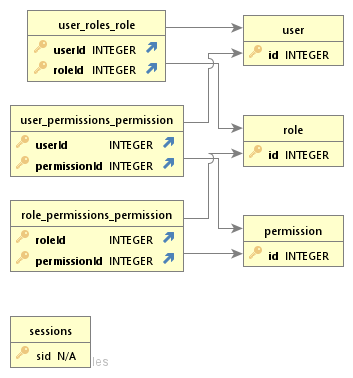

# Authentication and Authorization app

This web application features basic authentication and authorization features, and serves as a learning opportunity for TypeScript. It is by no means perfect. Things that can be improved is migrating to another data persistence technology, and offering more than one authentication option, like JWT tokens or social login.

# Highlights:
- Written in TypeScript.
- express for the web server.
- bcrypt for hashing passwords.
- passport for user authentication.
- typeorm for models and persistance.
- express-session for simple cookie sessions.
- SQLite database as data storage.
- Tests with mocha and chai.



# Endpoints
- `POST /login`
  - Unsecured endpoint, to allow users to login.
  - Requires email and password in body.
  - An admin user is initialized on first start.
  ```
  {
    "email": "admin@task.com",
    "password": "admin"
  }
  ```
- `POST /logout`
  - Unsecured endpoint, used to log current user out.
- `POST /register`
  - Unsecured endpoint, used to allow non-users to create a user account.
  ```
  {
    "name": "admin",
    "email": "admin@task.com",
    "password": "admin"
  }
  ```
## User endpoints
- `GET /users`
  - Secured endpoint, lists all users in database.
- `GET /users/:id`
  - Secured endpoint, lists a specific user.
- `POST /users`
  - Secured endpoint, creates a new user same as `/register`.
    ```
    {
      "name": "admin",
      "email": "admin@task.com",
      "password": "admin"
    }
    ```
- `DELETE /users/:id`
  - Secured endpoint, deletes a specific user.
- `PATCH /users/:id/permission/:id`
  - Secured endpoint, adds a specific permission to a user.
- `DELETE /users/:id/permission/:id`
  - Secured endpoint, revokes a specific permission from a user.
- `PATCH /users/:id/role/:id`
  - Secured endpoint, adds a specific role to a user.
- `DELETE /users/:id/role/:id`
  - Secured endpoint, revokes a role from a user.
- `DELETE /users/:id/session`
  - Secured endpoint, force invalidates user session(s).
## Role endpoints
- `GET /roles`
  - Secured endpoint, lists all roles.
- `GET /roles/:id`
  - Secured endpoint, lists a specific role.
- `POST /roles`
  - Secured endpoint, creates a new role.
    ```
    {
      "name": "administrator"
    }
    ```
- `DELETE /roles/:id`
  - Secured endpoint, deletes a specific role.
- `PATCH /roles/:id/permission/:id`
  - Secured endpoint, adds a specific permission to this role.
- `DELETE /roles/:id/permission/:id`
  - Secured endpoint, takes the permission back from the role.
## Permission endpoints
- `GET /permissions`
  - Secured endpoint, lists all permissions in the system.
- `GET /permissions/:id`
  - Secured endpoint, lists a specific permission.
- `POST /permissions`
  - Secured endpoint, creates a new permission.
    ```
    {
      "name": "read permissions"
    }
    ```
- `DELETE /permissions/:id`
  - Secured endpoint, deletes a permission from the system.

# Steps to run this project:

1. Run `yarn install` command.
2. Run `yarn start` command, then visit `http://localhost:3000/users` for a quick test.
3. For tests run `yarn test`.
